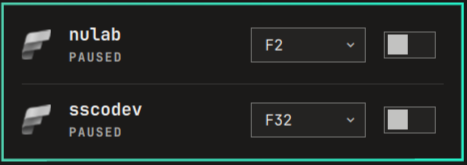

# omarchy-ms-fabric-capacity-control

An [Omarchy](https://omarchy.org) bar-widget plugin to pause/resume and resize
one or more Microsoft Fabric capacities directly from the bar.

Left-click the bar icon to see every configured capacity's live state, resize
it, or pause/resume it. Right-click to add or remove capacities by Azure
resource ID. The bar icon reflects the combined state across all configured
capacities (active/paused/transitioning) and flags an expired `az` login.



## Requirements

- [Omarchy](https://omarchy.org) with its Quickshell-based bar/plugin system
- The [Azure CLI](https://learn.microsoft.com/cli/azure/install-azure-cli)
  (`az`) installed, with an active `az login` session
- Azure RBAC permissions to read and update the target Fabric capacities
  (e.g. `Contributor` on the capacity resource)

## Installation

```sh
omarchy plugin add https://github.com/newunit13/omarchy-ms-fabric-capacity-control.git --enable
```

This clones the plugin into `~/.config/omarchy/plugins/fabric-capacity` and
enables it. Add it to a bar section from Omarchy's plugin manager if it
doesn't appear automatically.

To update later:

```sh
omarchy plugin update fabric-capacity
```

## Configuration

Right-click the bar icon to open the config panel:

- Paste one Azure resource ID per line, e.g.:
  ```
  /subscriptions/<subscription-id>/resourceGroups/<resource-group>/providers/Microsoft.Fabric/capacities/<capacity-name>
  ```
- **Refresh interval (seconds)** — default 60, how often to poll capacity
  state
- **Refresh interval while pausing/resuming (seconds)** — default 10, faster
  polling while a transition is in flight

Both interval settings are also available from Omarchy's generic widget
settings pane if you prefer to configure them there instead.

## Usage

- **Left-click** — open the panel showing every configured capacity's state,
  SKU picker, and pause/resume switch
- **Right-click** — open the config panel to add/remove capacity resource IDs
- **Middle-click** — refresh all capacities immediately

Resizing (SKU) only takes effect while a capacity is paused. If the `az` CLI's
cached login has expired, the plugin flags it and offers a one-click shortcut
to open a terminal running `az login`.

## License

MIT — see [LICENSE](LICENSE).
